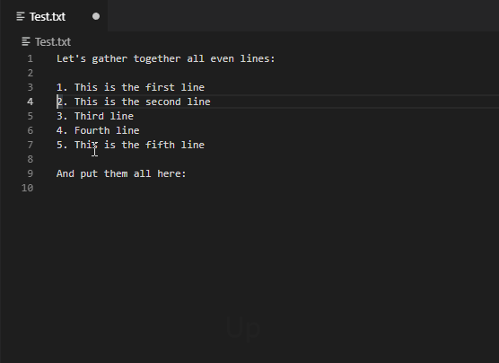

# 1. Copy 2. Gather 3. Paste 

VS Code extension "Copy-Gather-Paste"

## Features

The VS Code plugin permits several text copy/cut operations and paste the gathered buffer at once

## Keybindings
- Copy and Gather: __Shift-Alt-C__
- Cut and Gather: __Shift-Alt-X__
- Paste the buffer: __Shift-Alt-V__

## Release Notes

Initial, but, functional version

### 1.0.0
- Initial version

**Enjoy!** 
